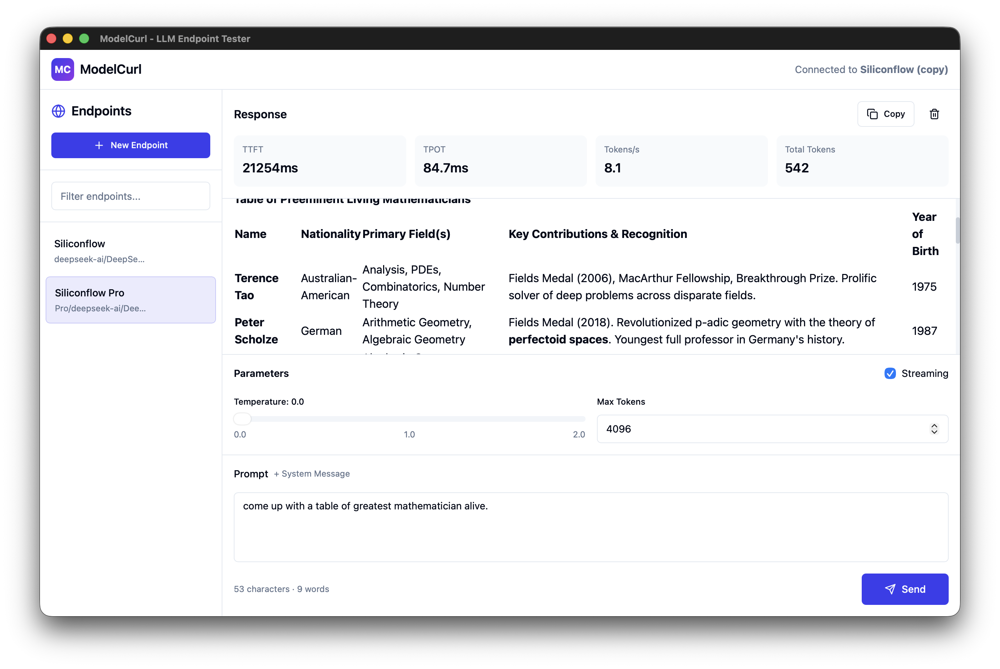

# ModelCurl

<div align="center">

  

  **A beautiful, cross-platform LLM endpoint testing utility with advanced performance metrics**

  [](https://opensource.org/licenses/MIT)
  [](https://tauri.app/)
  [](https://reactjs.org/)

  [Features](#features) • [Installation](#installation) • [Usage](#usage) • [Metrics](#metrics) • [Development](#development)

</div>

---

## 📸 Screenshot



---

## ✨ Features

### 🎯 Core Functionality
- **Multiple Endpoint Management** - Save and manage multiple LLM endpoints
- **Streaming & Non-Streaming** - Full support for both response modes
- **Real-time Performance Metrics** - TTFT, TPOT, throughput tracking
- **Beautiful Modern UI** - Clean, intuitive interface with dark mode support
- **Cross-Platform** - Works on macOS, Windows, and Linux

### 📊 Performance Metrics
- **TTFT (Time To First Token)** - Measure responsiveness from request to first token
- **TPOT (Time Per Output Token)** - Track token generation speed
- **Throughput** - Monitor tokens per second in real-time
- **Total Latency** - Complete end-to-end request timing
- **Token Count** - Track total tokens generated

### 🎨 User Experience
- **Syntax Highlighted Responses** - Markdown rendering with code highlighting
- **Quick Stats Dashboard** - Real-time performance metrics at a glance
- **Easy Endpoint Management** - API key and header management with persistence
- **Smart Error Handling** - Auto-dismissing error toasts with manual dismiss option
- **Conversation Memory** - System message support for multi-turn conversations
- **Keyboard Shortcuts** - Cmd/Ctrl+Enter to submit prompts
- **Offline UI** - Embedded web interface, no localhost server needed

---

## 🚀 Installation

### Prerequisites

**For Building from Source:**
- **Node.js** 18+ and npm
- **Rust** (for building from source)
- **System dependencies**:
  - **macOS**: None required
  - **Linux**: `libwebkit2gtk-4.0-dev libssl-dev libgtk-3-dev libayatana-appindicator3-dev librsvg2-dev`
  - **Windows**: Visual Studio C++ Build Tools (for building only)

**For Running Pre-built Binaries:**
- **Windows 10/11**: WebView2 Runtime (included in Windows 11, installed via Windows Update on Win10)
- **macOS**: macOS 11+ (Big Sur or later)
- **Linux**: GTK 3 and WebKitGTK (typically pre-installed)

### From Source

```bash
# Clone the repository
git clone https://github.com/hb4ch/modelcurl.git
cd modelcurl

# Install dependencies
npm install

# Run in development mode
npm run tauri dev

# Build for production
npm run tauri build
```

### Pre-built Binaries

Download the latest release for your platform:

**Windows x64** (Standalone - No installation required)
- Single executable with embedded UI
- Works on Windows 10/11 (WebView2 required - included in Windows 11)
- No external DLL dependencies
- Download: [ModelCurl.exe](https://github.com/hb4ch/modelcurl/releases)

**macOS** (Apple Silicon)
- Native Apple Silicon build
- Drag-and-drop installation
- Download: [ModelCurl.app](https://github.com/hb4ch/modelcurl/releases)

**Linux** (deb/rpm) - Coming soon

---

## 📝 Changelog

### v0.1.0 (Current)
**✨ Features**
- Multiple endpoint management with persistence
- Streaming and non-streaming request modes
- Real-time performance metrics (TTFT, TPOT, throughput)
- Custom header support for API authentication
- System message support for multi-turn conversations

**🐛 Bug Fixes**
- Fixed API key serialization issue (serde field name mapping)
- Fixed delete button being blocked by overlay in endpoint list
- Improved error handling with auto-dismissing toasts
- Fixed error message blocking send button

**🔧 Technical Improvements**
- Cross-platform build support (macOS → Windows)
- Static linking for standalone Windows binary
- Embedded UI assets (no localhost dependency)
- Custom protocol for production builds

---

## 📖 Usage

### Quick Start

1. **Configure an Endpoint**
   - Click "New Endpoint" in the sidebar
   - Enter your endpoint details:
     - **Name**: A friendly name (e.g., "OpenAI GPT-4")
     - **Base URL**: API endpoint (e.g., `https://api.openai.com/v1`)
     - **API Key**: Your API key (optional for local models)
     - **Model**: Model name (e.g., `gpt-3.5-turbo`)

2. **Set Parameters**
   - Adjust **Temperature** (0.0 - 2.0) for response randomness (default: 0.0)
   - Set **Max Tokens** to limit response length
   - Toggle **Streaming** for real-time token delivery

3. **Send a Prompt**
   - Type your message in the prompt area
   - Click "Send" or press `Cmd/Ctrl + Enter`
   - Watch the response stream in real-time!

### Example Endpoints

#### OpenAI
```
Name: OpenAI GPT-4
Base URL: https://api.openai.com/v1
API Key: sk-...
Model: gpt-4
```

#### Azure OpenAI
```
Name: Azure OpenAI
Base URL: https://your-resource.openai.azure.com/openai/deployments/your-deployment
API Key: your-azure-api-key
Model: gpt-35-turbo
```

#### Local LLM (Ollama)
```
Name: Local Ollama
Base URL: http://localhost:11434/v1
API Key: (leave empty)
Model: llama2
```

#### Anthropic (via proxy)
```
Name: Claude
Base URL: https://your-proxy.com/v1
API Key: your-anthropic-key
Model: claude-3-opus-20240229
```

---

## 🔧 Troubleshooting

### Windows: "Cannot connect to localhost" error
**Problem**: App tries to load UI from localhost:1420 instead of using embedded UI

**Solution**: Ensure you're using the production build with `custom-protocol` feature enabled:
```bash
npm run tauri build -- --target x86_64-pc-windows-gnu
```
The `custom-protocol` feature embeds the UI assets into the executable.

### Windows: "WebView2Loader.dll not found"
**Problem**: WebView2 Runtime is not installed

**Solution**:
- **Windows 11**: Already installed, no action needed
- **Windows 10**: Install via Windows Update or download from [Microsoft WebView2](https://developer.microsoft.com/en-us/microsoft-edge/webview2/)

### Configuration file locations
Endpoints and history are stored in:
- **Windows**: `%APPDATA%\modelcurl\`
- **macOS**: `~/Library/Application Support/modelcurl/`
- **Linux**: `~/.config/modelcurl/`

Files:
- `endpoints.json` - Saved endpoint configurations (including API keys)
- `history.json` - Request history (coming soon)

### API key disappears after saving
**Problem**: API key field is empty when reopening endpoint configuration

**Solution**: This was a serialization bug fixed in v0.1.0. Update to the latest version.

### Endpoint delete button doesn't work
**Problem**: Hovering over endpoint doesn't show delete button

**Solution**: This was a UI bug fixed in v0.1.0. Update to the latest version.

---

## 📊 Understanding Metrics

### TTFT (Time To First Token)
The time from when the request is sent until the first token is received. Lower is better.

**What it measures**: Initial processing time, cold starts, and network latency

**Good ranges**:
- Local models: < 100ms
- Cloud APIs: 200-500ms
- Edge deployments: 100-300ms

### TPOT (Time Per Output Token)
The average time between consecutive tokens during generation.

**What it measures**: Token generation throughput and model inference speed

**Good ranges**:
- Fast generation: < 10ms
- Normal: 10-50ms
- Slow: > 50ms

### Throughput (Tokens/Second)
How many tokens are generated per second.

**Calculation**: `Total Tokens / Total Generation Time`

**Good ranges**:
- Excellent: > 100 tokens/s
- Good: 50-100 tokens/s
- Acceptable: 20-50 tokens/s

### Total Latency
Complete round-trip time from request to final token.

**What it measures**: Overall user-perceived responsiveness

---

## 🛠️ Development

### Project Structure

```
modelcurl/
├── src/                    # React frontend
│   ├── components/        # UI components
│   ├── hooks/            # Custom React hooks
│   ├── stores/           # State management (Zustand)
│   ├── types/            # TypeScript definitions
│   └── styles/           # CSS/Tailwind config
│
├── src-tauri/            # Rust backend
│   ├── src/
│   │   ├── commands.rs   # Tauri IPC handlers
│   │   ├── http.rs       # HTTP client
│   │   ├── metrics.rs    # Metrics calculation
│   │   └── types.rs      # Shared types
│   └── Cargo.toml        # Rust dependencies
│
└── DESIGN.md            # Complete design documentation
```

### Key Technologies

**Frontend**
- React 18 + TypeScript
- TailwindCSS for styling
- Zustand for state management
- React Markdown for response rendering

**Backend**
- Rust + Tauri
- reqwest for HTTP
- tokio for async runtime
- serde for serialization

### Development Scripts

```bash
# Install dependencies
npm install

# Run development server
npm run dev

# Run Tauri in dev mode
npm run tauri dev

# Type check
npm run check

# Build frontend
npm run build

# Build Tauri app
npm run tauri build
```

### Cross-Compilation (macOS → Windows)

To build Windows binaries from macOS:

```bash
# Install Windows target and mingw-w64
rustup target add x86_64-pc-windows-gnu
brew install mingw-w64

# Configure cargo for static linking
cat >> ~/.cargo/config.toml << 'EOF'
[target.x86_64-pc-windows-gnu]
linker = "/opt/homebrew/opt/mingw-w64/bin/x86_64-w64-mingw32-gcc"
ar = "/opt/homebrew/opt/mingw-w64/bin/x86_64-w64-mingw32-ar"
rustflags = ["-C", "link-args=-static -s"]
EOF

# Build for Windows with custom protocol (embedded UI)
npm run tauri build -- --target x86_64-pc-windows-gnu

# Output: src-tauri/target/x86_64-pc-windows-gnu/release/ModelCurl.exe
```

**Note**: The `custom-protocol` feature is required for production builds to embed the UI assets. Without it, the app will try to load from `http://localhost:1420` instead of using bundled resources.

### Adding New Features

1. **New Metrics**: Add to `src-tauri/src/metrics.rs` and update UI in `ResponseDisplay.tsx`
2. **New API Parameters**: Extend `LLMRequest` type and add UI controls
3. **Custom Charts**: Add to `MetricsDashboard` component with Recharts

---

## 🎯 Roadmap

### v0.2 (Planned)
- [ ] Metrics history and trend visualization
- [ ] Export metrics to CSV/JSON
- [ ] Request history with search and filter
- [ ] Dark mode toggle
- [ ] Multi-language support
- [ ] Linux builds (deb/rpm/AppImage)

### v0.3 (Future)
- [ ] Concurrent request testing
- [ ] Load testing mode with concurrent connections
- [ ] Custom metrics visualization and charts
- [ ] Plugin system for custom analyzers
- [ ] Command-line interface for automation

---

## 🤝 Contributing

Contributions are welcome! Please feel free to submit a Pull Request.

1. Fork the repository
2. Create your feature branch (`git checkout -b feature/AmazingFeature`)
3. Commit your changes (`git commit -m 'Add some AmazingFeature'`)
4. Push to the branch (`git push origin feature/AmazingFeature`)
5. Open a Pull Request

---

## 📄 License

This project is licensed under the MIT License - see the [LICENSE](LICENSE) file for details.

---

## 🙏 Acknowledgments

- [Tauri](https://tauri.app/) - Cross-platform desktop framework
- [React](https://reactjs.org/) - UI framework
- [TailwindCSS](https://tailwindcss.com/) - Styling
- [Recharts](https://recharts.org/) - Data visualization
- [Lucide Icons](https://lucide.dev/) - Beautiful icons
- [mingw-w64](https://www.mingw-w64.org/) - Windows cross-compilation toolchain

---

## 📧 Support

- 📖 [Documentation](https://github.com/hb4ch/modelcurl/wiki)
- 🐛 [Issue Tracker](https://github.com/hb4ch/modelcurl/issues)
- 💬 [Discussions](https://github.com/hb4ch/modelcurl/discussions)

---

<div align="center">
  Made with ❤️ by the ModelCurl team
</div>
